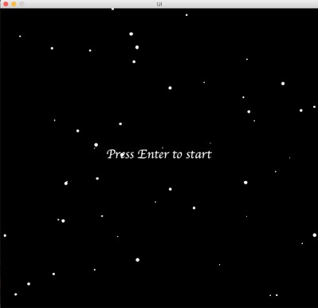
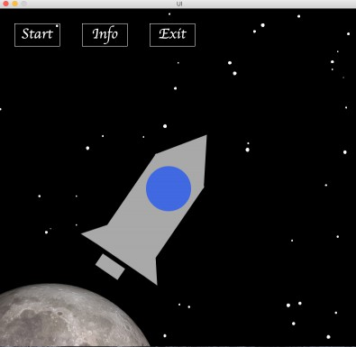
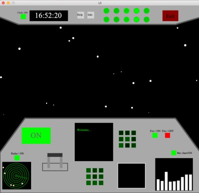
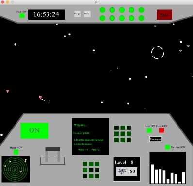

# SciFi UI Project

Name: Taif AL Beedh

Student Number: D17125070

Fork this repository and use it a starter project for your assignment

# Description of the assignment
This assignment is about creating a user interface for a science fiction idea using java and processing. The purpose behind this assignment is to practice what I have leaned and to improve my coding skills plus getting the chance to use git. I struggled in the beginning to find an idea for my assignment, as science fiction is not one of my strongest points. However, I had a chat with a couple of friends who are fans of science fiction movies and games. They inspired me to come up with the idea of a spaceship. 

# Instructions
The user must press enter to start the program, the main page will then be displayed. The main page will contain 3 buttons. First, an info button which will display some information. Second, an exit button this button will ask the user to confirm their choice of exiting the program. If the user chose either the info or the exit button a return button will be displayed in case the user wants to go back to the main page. Third, a start button to show the spaceship from inside, inside the spaceship there are a lot of different buttons, however none of them (except the exit button) will work unless the start button is clicked. After clicking the start button the user can click any button, such as:

• Radar : displays the radar.

• Clock : shows a digital clock.

• Bar chart : shows a bar chart.

• Fire on : If the user clicked on the fire on button extra information will be displayed on the screen, and diamonds will       appear on the background, after collecting a specific amount of diamonds the user’s level will be increased, as well as       displaying a sound effect, there is also an extra button in case the user can’t find any diamonds.

• Fire off : stop the diamonds from appearing and it will get rid of the extra information on the screen.

• Spaceship speed : speed the background.

• Information button : sound effect.

• Help button: an emergency sound effect.


# How it works
To make my program work I created 11 classes:

• Main : used to execute the UI class.

• UI : this class includes declaring and initializing some objects, plus passing some parameters, this class also includes       loading a table (Numbers.csv), text file (screen.txt) and some sound files, I also used integer variables, if statements,     checkKey(), and mousePressed() to check some conditions (x and y values) before calling the methods. 

```Java
if (checkKey(ENTER))
        {
            

            
            if(checkbutton == 1)
            {   
                
                button1.buttons();
                button2.buttons();
                button3.buttons();
                background.star1();
                background.spaceship();
                if(mousePressed == true)
                {
                    //for the first button Start
                    if(mouseX > buttonX && mouseX < buttonX + 100 && mouseY > buttonY && mouseY < buttonY + 50)
                    {
                        button = 1;
                    }
                    //for the second button Information
                    if(mouseX > buttonX + 150 && mouseX < buttonX + 250 && mouseY > buttonY && mouseY < buttonY + 50)
                    {
                        button = 2;
                        //background.movingstars(); 
                    }
                    //for the third button Exit
                    if(mouseX > buttonX + 300 && mouseX < buttonX + 400 && mouseY > buttonY && mouseY < buttonY + 50)
                    {
                        button = 3;  
                    }
                    if(mouseX > buttonX + 450 && mouseX < buttonX + 550 && mouseY > buttonY && mouseY < buttonY + 50)
                    {
                        button = 4;
                    }
                
                }
            }
```

• BackGround : a subclass of SpaceObject, it loads and displays an image, displays the borders of some pages, shows the         spaceship structure, and a couple of different backgrounds, like the moving stars background (after starting the spaceship),   moving the stars from left to right (in the main page), speeding the background and the non-moving stars background (before   pressing enter). This class also includes some functions like pushMatrix(), popMatrix(), beginShape(), endShape() rotate()     and translate().

```Java
ui.pushMatrix();
ui.translate(380, -80);
ui.rotate(0.6f);
ui.noStroke();
ui.rect(200, 350 + moverotate, 130, 240);
ui.popMatrix();
```


```Java
ui.beginShape();
ui.fill(169,169,169);
ui.vertex(0, ui.height/4 + 400);
ui.vertex(ui.width/8, ui.height/3 + 200);
ui.vertex(ui.width/8, ui.height/3 + 200);
ui.vertex(ui.width - 100,ui.height/3 + 200);
ui.vertex(ui.width - 100,ui.height/3 + 200);
ui.vertex(ui.width, ui.height/4 + 400);
ui.vertex(ui.width, ui.height/4 + 400);
ui.vertex(ui.width, ui.height);
ui.vertex(ui.width, ui.height);
ui.vertex(0, ui.height);
ui.vertex(0, ui.height);
ui.vertex(0, ui.height/4 + 400);
ui.endShape();  
```

• Button: this class is a subclass of SpaceObject, it is responsible for all the buttons in the program. 

• Clock: a subclass of SpaceObject, it displays a digital clock. 

• ExtraButton: a subclass of SpaceObject, it only displays the non-functional buttons, using the random() function to     change their colors.

```Java
ui.fill(0,ui.random(100),0);
```

• Graph: this class is also a subclass of SpaceObject, it shows a moving bar chart depending on the temperature, map() function is used in the drawgraph() method and the random() function is used in the update method to change the bar values.

```Java
ui.rect(value +j, ui.map(i, 0, Temperature.length, ui.height-11, ui.height-11), h, -Temperature[i]/4);
```

```Java
Temperature[i] = ui.random(0, 330);
```

• Radar: this class is a subclass of SpaceObject, shows the radar with the moving planets on it using different           functions.

• Screen: a subclass of SpaceObject, this class shows the screen and displays the instructions on it.

• SpaceObject: this is an abstract class.

• Targets: this is a subclass of SpaceObject, this class is responsible for loading images using an array, displaying the       images on the background, loading and displaying a sound file, creating a table, adding a target pointer around the           mouse, counting the points, showing what the user has collected, removing the collected diamond using the mousePressed()       function, and increasing the user’s level. 


# What I am most proud of in the assignment

I’m glad that I had this opportunity to practice what I have learned so far in my course and to improve my coding skills. This assignment helped me practice my skills not only in programming but my problem solving skills as well as time management. I faced some difficulties with coding as well as coming up with ideas. However, I was able to overcome those difficulties and learned from them. Finally, I’m satisfied with the final result I have achieved so far.

# Markdown Tutorial

## Polymorphism:
clock.java is a subclass of SpaceObject

```Java
public class Clock extends SpaceObject 
{
    private float x;
    private float y;


    public Clock(UI ui, float x, float y)
    {
        super(ui);
        this.x = x;
        this.y = y;
    }
}
```
## Interfaces:

Interface.java

```Java
package ie.tudublin;
// public interface Interface 
// {
//    public void applyTo(Button fireon);
// }
```
Display.java

```Java
package ie.tudublin;
// public class Display extends SpaceObject implements Interface
// {
//     public Display(UI ui)
//     {
//         super(ui);
//     }
// }
```

## PVectors

Radar.java

```Java
package ie.tudublin;

import processing.core.PVector;

public class Radar extends SpaceObject
{
    private PVector pos;
    private float x;
    private float y;
    // private float speed;
    private float size;
    float[] planetx = new float[5];
    float[] planety = new float[5];
    int num1 = 0;

    private float rotation;
    // float speed
    public Radar(UI ui, float x, float y,  float size)
    {
        super(ui);
        pos = new PVector(x, y);
        // this.speed = speed;
        this.size = size;
        while(num1 < 5)
        {
            planetx[num1] = ui.random(12, 110);
            planety[num1] = ui.random(630, 720);

            num1++;
        }
        
    }

    public void rect()
    {
        ui.fill(0);
        ui.noStroke();
        ui.rect(10,625,115,110);
    }

    public void render()
    {

        float howFast = 2;
        

        ui.pushMatrix();
        ui.noFill();
        ui.strokeWeight(2);
        ui.stroke(0,128,0);
        ui.circle(pos.x, pos.y, size);
        ui.circle(pos.x, pos.y, size-15);
        ui.circle(pos.x, pos.y, size-30);
        ui.circle(pos.x, pos.y, size-45);
        ui.circle(pos.x, pos.y, size-60);
        ui.circle(pos.x, pos.y, size-75);
        ui.circle(pos.x, pos.y, size-90);
        ui.circle(pos.x, pos.y, size-98);
        ui.translate(pos.x, pos.y);
        ui.rotate(rotation);


        ui.stroke(0,128,0);

        ui.line(0, 0, pos.x/2, pos.x/2);
        ui.popMatrix();
        float size1 = 6;

        for(int i = 0; i< 5; i++)
        {
            ui.noStroke();
            ui.fill(255,218,185);
            planety[i] += 0.09f;

            if(planety[i] > 720)
            {
                planety[i]= 630;
                planetx[i] = ui.random(12, 110);
        
            }
            ui.ellipse(planetx[i], ui.map(i, 0, 100, planety[i] , planety[i]), size1, size1);
            
        }
    }
    
    public void update()
    {
        rotation += 0.1f;
    }


}
```

## Transforms:

BackGround.java

```Java
void spaceship()
{
	ui.noStroke();
	ui.image(img, -140, 610, 500, 500);


	ui.fill(169,169,169);
	ui.noStroke();
	ui.triangle(344 , 324 - move, 460 , 280 - move, 453 , 400 - move);
	ui.triangle(180 + move, 500 - move, 240 + move, 480 - move, 215 + move, 522 - move);
	ui.triangle(345 + move, 530 - move, 350 + move, 615 - move, 319 + move, 593 - move);

	ui.pushMatrix();
	ui.translate(380, -80);
	ui.rotate(0.6f);
	ui.noStroke();
	ui.rect(200, 350 + moverotate, 130, 240);

	ui.popMatrix();
	ui.pushMatrix();
	ui.translate(335, -50);
	ui.rotate(0.6f);
	ui.rect(248, 550 + moverotate, 60, 30);
	ui.popMatrix();

	ui.noStroke();
	ui.fill(65,105,225);
	ui.circle(375 + move, 400 - move, 100);
}
```
## Images:

Press Enter to start:



The main page:



Start button:



Fireon button:



## Video:

This is a youtube video:

[](https://www.youtube.com/watch?v=5-5PN0A0v3M&feature=youtu.be)


